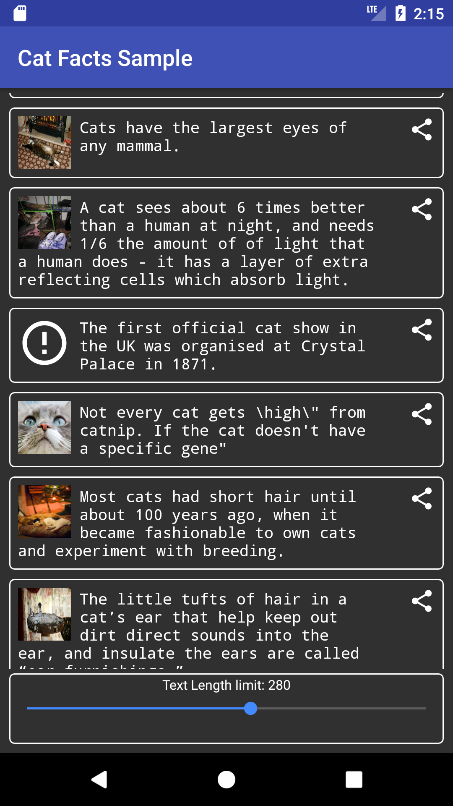
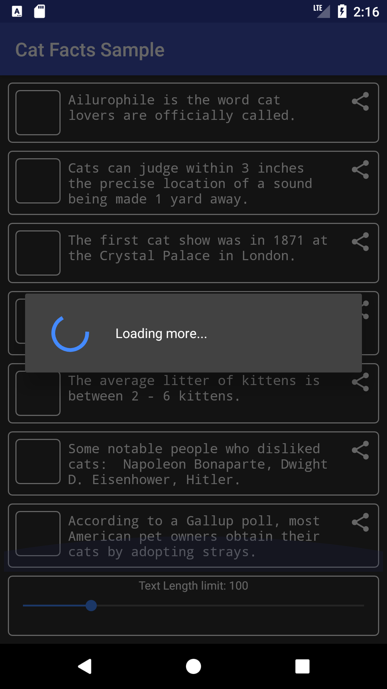

## CatFactsSample
Android sample project to show <a href="https://catfact.ninja">Cat Facts API</a> and <a href="http://thecatapi.com">The Cat API</a> functionality.

# Screenshots
&nbsp;
&nbsp;

# Developer

* [Taras Zmyi](https://github.com/tZpace)